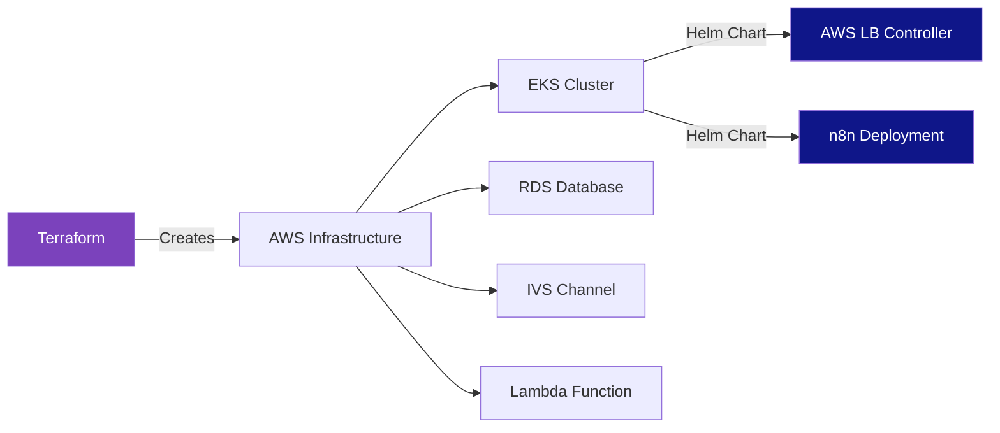

# n8n AWS Streaming Platform 🎬

A complete infrastructure setup for streaming from OBS to AWS IVS, with automated frame sampling via Lambda and analysis through n8n running on EKS.

## Architecture Overview

```mermaid
graph TB
    subgraph "Hong Kong"
        OBS[OBS Studio on Laptop]
    end
    
    subgraph "AWS ap-southeast-1 Singapore"
        subgraph "AWS IVS"
            IVS[IVS Channel BASIC<br/>Low Latency Mode]
            StreamKey[Stream Key]
        end
        
        subgraph "EventBridge"
            EB[EventBridge Rule<br/>Rate: 5 seconds]
        end
        
        subgraph "Lambda"
            Lambda[Frame Sampler<br/>Python 3.11 ARM64<br/>512MB]
        end
        
        subgraph "VPC 10.0.0.0/16"
            subgraph "Public Subnets"
                NLB[Network Load Balancer]
                NAT[NAT Gateway]
            end
            
            subgraph "Private Subnets"
                subgraph "EKS Cluster"
                    N8N1[n8n Pod 1]
                    N8N2[n8n Pod 2]
                    N8N3[n8n Pod 3]
                    HPA[Horizontal Pod Autoscaler<br/>CPU > 70%]
                end
                
                RDS[(RDS PostgreSQL<br/>t4g.micro ARM64)]
            end
        end
    end
    
    OBS -->|RTMPS Stream| IVS
    IVS -->|Stream Events| EB
    EB -->|Trigger every 5s| Lambda
    Lambda -->|Get Stream Info| IVS
    Lambda -->|POST Frame Data| NLB
    NLB --> N8N1
    NLB --> N8N2
    NLB --> N8N3
    HPA -.->|Scales| N8N1
    HPA -.->|Scales| N8N2
    HPA -.->|Scales| N8N3
    N8N1 -->|Read/Write| RDS
    N8N2 -->|Read/Write| RDS
    N8N3 -->|Read/Write| RDS
    
    style OBS fill:#e1f5ff
    style IVS fill:#ff9900
    style Lambda fill:#ff9900
    style N8N1 fill:#ea4b71
    style N8N2 fill:#ea4b71
    style N8N3 fill:#ea4b71
    style RDS fill:#527fff
    style NLB fill:#ff9900
    style HPA fill:#326ce5
```

## Deployment Methods



**We use:**
- 🏗️ **Terraform** - All AWS infrastructure (VPC, EKS, RDS, IVS, Lambda)
- ⎈ **Helm Charts** - All Kubernetes deployments (AWS LB Controller + n8n)

*Alternative: Raw YAML manifests available in `kubernetes/raw-yaml/` - see [docs/DEPLOYMENT_OPTIONS.md](docs/DEPLOYMENT_OPTIONS.md)*

## Features

- ✅ **AWS IVS BASIC** channel for cost-effective streaming
- ✅ **Lambda with Graviton2** (ARM64) - 20% cost savings
- ✅ **EKS with auto-scaling** - n8n scales from 1-3 pods based on CPU
- ✅ **RDS PostgreSQL t4g.micro** - ARM-based for cost efficiency
- ✅ **Single NAT Gateway** - Dev-optimized for minimal costs
- ✅ **VPC Endpoints** - Reduce NAT gateway data transfer costs
- ✅ **Configurable frame rate** - Default 5s, easily adjustable to FPS

## Cost Estimate (ap-southeast-1)

| Service | Configuration | Monthly Cost (USD) |
|---------|--------------|-------------------|
| IVS BASIC | Pay per streaming hour | ~$1.50/hour when streaming |
| EKS Control Plane | - | ~$73 |
| EC2 (t3.medium) | 1 node | ~$33 |
| RDS (t4g.micro) | PostgreSQL | ~$12 |
| NAT Gateway | Single | ~$35 |
| Lambda | ARM64, minimal invocations | ~$2-5 |
| **Total** | | **~$155-160/month** + streaming hours |

💡 **Cost Savings Tips:**
- Stop streaming when not in use (IVS is pay-per-hour)
- Use spot instances for EKS nodes (can reduce EC2 costs by 70%)
- Adjust Lambda sampling rate based on needs

## Prerequisites

- AWS CLI configured with appropriate credentials
- Terraform >= 1.5.0
- kubectl >= 1.28
- Helm >= 3.11
- OBS Studio (or any RTMPS-capable streaming software)

## Quick Start

### 1. Deploy Infrastructure

```bash
cd terraform

# Initialize Terraform
terraform init

# Review the plan
terraform plan

# Deploy (takes ~15-20 minutes)
terraform apply

# Save outputs for later use
terraform output -json > outputs.json
```

### 2. Configure kubectl

```bash
# Get the cluster name from outputs
aws eks update-kubeconfig --region ap-southeast-1 --name $(terraform output -raw eks_cluster_name)

# Verify connection
kubectl get nodes
```

### 3. Install AWS Load Balancer Controller

```bash
# Add the EKS chart repo
helm repo add eks https://aws.github.io/eks-charts
helm repo update

# Get the ALB controller role ARN
ALB_ROLE_ARN=$(terraform output -raw eks_alb_controller_role_arn)

# Install the controller
helm install aws-load-balancer-controller eks/aws-load-balancer-controller \
  -n kube-system \
  --set clusterName=$(terraform output -raw eks_cluster_name) \
  --set serviceAccount.create=true \
  --set serviceAccount.name=aws-load-balancer-controller \
  --set serviceAccount.annotations."eks\.amazonaws\.com/role-arn"=$ALB_ROLE_ARN

# Verify installation
kubectl get deployment -n kube-system aws-load-balancer-controller
```

### 4. Deploy n8n with Helm

```bash
cd ../kubernetes

# Add n8n Helm repository
helm repo add 8gears https://8gears.container-registry.com/chartrepo/library
helm repo update

# Get RDS credentials
RDS_ENDPOINT=$(cd ../terraform && terraform output -raw rds_endpoint)
RDS_HOST=${RDS_ENDPOINT%:*}
RDS_PASSWORD=$(aws secretsmanager get-secret-value \
  --region ap-southeast-1 \
  --secret-id $(cd ../terraform && terraform output -raw rds_password_secret_arn) \
  --query SecretString \
  --output text)
ENCRYPTION_KEY=$(openssl rand -base64 32)

# Create values file with credentials
cat > n8n-values-deploy.yaml <<EOF
config:
  database:
    type: postgresdb
    postgresdb:
      host: "${RDS_HOST}"
      port: 5432
      database: "n8n"
      user: "n8nadmin"
      password: "${RDS_PASSWORD}"
  generic:
    timezone: "Asia/Singapore"
  encryptionKey: "${ENCRYPTION_KEY}"

service:
  type: LoadBalancer
  port: 80
  annotations:
    service.beta.kubernetes.io/aws-load-balancer-type: "nlb"
    service.beta.kubernetes.io/aws-load-balancer-scheme: "internet-facing"

autoscaling:
  enabled: true
  minReplicas: 1
  maxReplicas: 3
  targetCPUUtilizationPercentage: 70

resources:
  requests:
    cpu: 200m
    memory: 512Mi
  limits:
    cpu: 1000m
    memory: 1Gi
EOF

# Install n8n via Helm
helm install n8n 8gears/n8n \
  -n n8n \
  --create-namespace \
  -f n8n-values-deploy.yaml

# Wait for deployment
kubectl wait --for=condition=available --timeout=300s deployment/n8n-n8n -n n8n

# Get the Load Balancer URL
kubectl get svc -n n8n
```

### 5. Configure OBS

```bash
# Get IVS streaming credentials
cd terraform
terraform output ivs_ingest_endpoint
terraform output -raw ivs_stream_key
```

**In OBS:**
1. Go to Settings → Stream
2. Service: Custom
3. Server: `<ivs_ingest_endpoint>` (from terraform output)
4. Stream Key: `<ivs_stream_key>` (from terraform output)
5. Click OK and start streaming!

### 6. Access n8n

```bash
# Get the n8n URL
N8N_URL=$(kubectl get svc n8n-service -n n8n -o jsonpath='{.status.loadBalancer.ingress[0].hostname}')
echo "n8n URL: http://$N8N_URL"

# Open in browser
open "http://$N8N_URL"
```

## Configuration

### Adjust Frame Sampling Rate

To change the frame sampling rate (default: 5 seconds):

```bash
cd terraform

# Edit variables.tf or use -var flag
terraform apply -var="lambda_frame_sample_rate=2"  # Sample every 2 seconds

# For sub-second sampling (e.g., 2 FPS):
# Note: EventBridge minimum is 1 second, but you can use cron expressions
# Or modify Lambda to sample multiple frames per invocation
```

### Scale n8n Pods

The HPA automatically scales based on CPU (70% threshold). To manually adjust:

```bash
# Edit HPA thresholds
kubectl edit hpa n8n-hpa -n n8n

# Or update the YAML and reapply
kubectl apply -f kubernetes/n8n-hpa.yaml
```

### View Logs

```bash
# Lambda logs
aws logs tail /aws/lambda/n8n-streaming-dev-frame-sampler --follow --region ap-southeast-1

# n8n logs
kubectl logs -f deployment/n8n -n n8n

# EKS node logs
kubectl get events -n n8n --sort-by='.lastTimestamp'
```

## n8n Workflow Setup

1. Access n8n UI via the Load Balancer URL
2. Create a new workflow
3. Add a **Webhook** node:
   - HTTP Method: POST
   - Path: `frame-analysis`
4. Add processing nodes (e.g., Function, HTTP Request, etc.)
5. Activate the workflow
6. The Lambda function will POST frame data to: `http://n8n-service.n8n.svc.cluster.local:5678/webhook/frame-analysis`

### Expected Webhook Payload

```json
{
  "timestamp": "2025-10-02T12:34:56.789Z",
  "channel_arn": "arn:aws:ivs:...",
  "stream_info": {
    "state": "LIVE",
    "health": "HEALTHY",
    "viewer_count": 5,
    "start_time": "2025-10-02T12:00:00Z",
    "playback_url": "https://..."
  },
  "frame": {
    "format": "jpeg",
    "encoding": "base64",
    "data": "base64_encoded_image_data"
  },
  "metadata": {
    "aws_region": "ap-southeast-1",
    "lambda_request_id": "...",
    "sampler_version": "1.0.0"
  }
}
```

## Monitoring

### CloudWatch Dashboards

```bash
# View Lambda metrics
aws cloudwatch get-metric-statistics \
  --namespace AWS/Lambda \
  --metric-name Invocations \
  --dimensions Name=FunctionName,Value=n8n-streaming-dev-frame-sampler \
  --start-time $(date -u -d '1 hour ago' +%Y-%m-%dT%H:%M:%S) \
  --end-time $(date -u +%Y-%m-%dT%H:%M:%S) \
  --period 300 \
  --statistics Sum \
  --region ap-southeast-1

# View IVS metrics
aws cloudwatch get-metric-statistics \
  --namespace AWS/IVS \
  --metric-name ConcurrentViews \
  --dimensions Name=Channel,Value=$(cd terraform && terraform output -raw ivs_channel_arn) \
  --start-time $(date -u -d '1 hour ago' +%Y-%m-%dT%H:%M:%S) \
  --end-time $(date -u +%Y-%m-%dT%H:%M:%S) \
  --period 300 \
  --statistics Average \
  --region ap-southeast-1
```

### Kubernetes Metrics

```bash
# Check HPA status
kubectl get hpa -n n8n

# Check pod resource usage
kubectl top pods -n n8n

# Check node resource usage
kubectl top nodes
```

## Troubleshooting

### Lambda not receiving frames

1. Check if stream is live:
   ```bash
   aws ivs get-stream --channel-arn $(cd terraform && terraform output -raw ivs_channel_arn) --region ap-southeast-1
   ```

2. Check Lambda logs:
   ```bash
   aws logs tail /aws/lambda/n8n-streaming-dev-frame-sampler --follow --region ap-southeast-1
   ```

3. Verify EventBridge rule is enabled:
   ```bash
   aws events list-rules --region ap-southeast-1 | grep frame-sampling
   ```

### n8n pods not starting

1. Check pod status:
   ```bash
   kubectl describe pod -l app=n8n -n n8n
   ```

2. Check RDS connectivity:
   ```bash
   kubectl run -it --rm debug --image=postgres:15 --restart=Never -- \
     psql -h <RDS_ENDPOINT> -U n8nadmin -d n8n
   ```

3. Check secrets:
   ```bash
   kubectl get secret n8n-secrets -n n8n -o yaml
   ```

### Load Balancer not creating

1. Check controller logs:
   ```bash
   kubectl logs -n kube-system deployment/aws-load-balancer-controller
   ```

2. Verify IAM role:
   ```bash
   kubectl describe sa aws-load-balancer-controller -n kube-system
   ```

## Cleanup

⚠️ **Warning:** This will delete all resources and data!

```bash
# Delete Kubernetes resources
kubectl delete namespace n8n

# Destroy Terraform infrastructure
cd terraform
terraform destroy

# Confirm when prompted
```

## Production Recommendations

When moving to production, consider these upgrades:

1. **High Availability:**
   - Multiple NAT Gateways (one per AZ)
   - Multi-AZ RDS deployment
   - Increase EKS node count

2. **Security:**
   - Use AWS Certificate Manager for HTTPS
   - Enable VPC Flow Logs
   - Implement AWS WAF for ALB
   - Use Secrets Manager for n8n credentials

3. **Monitoring:**
   - Set up CloudWatch alarms
   - Enable Container Insights
   - Implement distributed tracing

4. **Backup:**
   - Enable RDS automated backups (7-30 days)
   - Use EBS snapshots for node volumes
   - Export n8n workflows regularly

5. **Performance:**
   - Upgrade to IVS STANDARD for better quality
   - Use larger instance types (c6i.large, etc.)
   - Enable RDS read replicas if needed

## License

MIT

## Contributing

Pull requests welcome! Please ensure:
- Terraform code is formatted: `terraform fmt -recursive`
- All resources have appropriate tags
- Update documentation for any changes

## Support

For issues or questions:
- AWS IVS: https://docs.aws.amazon.com/ivs/
- n8n: https://docs.n8n.io/
- EKS: https://docs.aws.amazon.com/eks/

---

Built with ❤️ for streaming and automation enthusiasts

