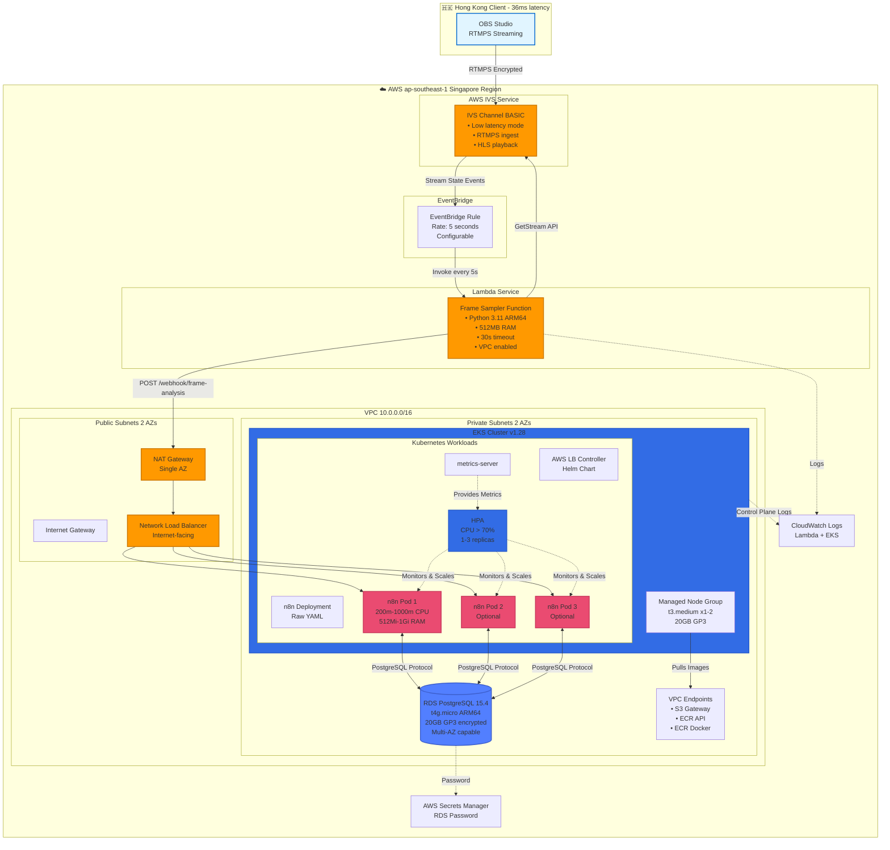
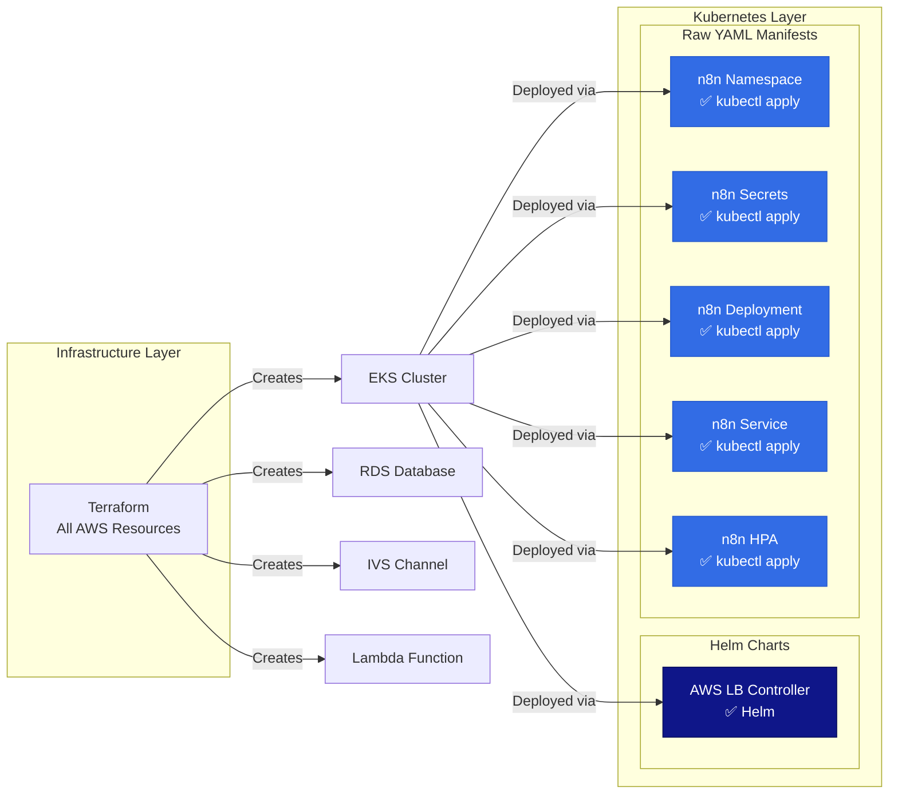

# Architecture Documentation

## Overview

This document provides detailed information about the architecture of the n8n AWS Streaming Platform.

## High-Level Architecture



### Deployment Methods



## Component Details

### 1. AWS IVS (Interactive Video Service)

**Purpose:** Managed live streaming service for ingesting RTMPS streams from OBS.

**Configuration:**
- **Channel Type:** BASIC (dev) or STANDARD (prod)
- **Latency Mode:** LOW (<3 seconds)
- **Protocol:** RTMPS (encrypted)
- **Output:** HLS playback URL

**Cost Optimization:**
- BASIC channel: ~$1.50/hour when streaming
- No recording enabled by default (saves S3 costs)
- Pay-per-hour model (only pay when streaming)

**Security:**
- Stream key authentication
- Encrypted RTMPS ingest
- Private stream keys stored in Terraform state

### 2. Lambda Frame Sampler

**Purpose:** Periodically sample frames from the live stream and send to n8n for analysis.

**Architecture:**
- **Runtime:** Python 3.11 on ARM64 (Graviton2)
- **VPC:** Deployed in private subnets
- **Trigger:** EventBridge rule (configurable rate)
- **Memory:** 512MB (configurable)
- **Timeout:** 30 seconds

**Workflow:**
1. EventBridge triggers Lambda every N seconds
2. Lambda calls IVS GetStream API to check stream status
3. If stream is LIVE, fetches thumbnail from playback URL
4. Encodes thumbnail to base64
5. POSTs JSON payload to n8n webhook

**Payload Schema:**
```json
{
  "timestamp": "ISO 8601 datetime",
  "channel_arn": "ARN of IVS channel",
  "stream_info": {
    "state": "LIVE|OFFLINE",
    "health": "HEALTHY|STARVING|UNKNOWN",
    "viewer_count": 0,
    "start_time": "ISO 8601 datetime",
    "playback_url": "HLS URL"
  },
  "frame": {
    "format": "jpeg",
    "encoding": "base64",
    "data": "base64 string or null"
  },
  "metadata": {
    "aws_region": "ap-southeast-1",
    "lambda_request_id": "AWS request ID",
    "sampler_version": "1.0.0"
  }
}
```

**Cost Optimization:**
- ARM64 (Graviton2): 20% cheaper than x86
- Runs in VPC with VPC endpoints to reduce NAT costs
- Minimal memory allocation (512MB)

### 3. VPC Architecture

**CIDR:** 10.0.0.0/16

**Subnets:**
- **Public Subnets:** 2 AZs (10.0.0.0/20, 10.0.16.0/20)
  - Internet Gateway attached
  - Used for Load Balancers and NAT Gateway
  
- **Private Subnets:** 2 AZs (10.0.32.0/20, 10.0.48.0/20)
  - NAT Gateway for outbound internet
  - EKS nodes, RDS, Lambda deployed here

**NAT Gateway:**
- Single NAT in first AZ (dev cost optimization)
- Production: Should use one NAT per AZ for high availability

**VPC Endpoints:**
- **S3 Gateway Endpoint:** Free, reduces NAT costs
- **ECR Interface Endpoints:** For pulling container images privately
- **ECR API Endpoint:** For Docker registry operations

**Security Groups:**
- **EKS Cluster SG:** Cluster control plane communication
- **EKS Node SG:** Worker nodes, allows intra-cluster communication
- **RDS SG:** Only accessible from EKS nodes
- **Lambda SG:** Outbound only
- **VPC Endpoint SG:** HTTPS from VPC CIDR

### 4. EKS Cluster

**Version:** 1.28 (configurable)

**Control Plane:**
- Managed by AWS
- Multi-AZ for high availability
- Private + Public API endpoint

**Node Group:**
- **Instance Type:** t3.medium (2 vCPU, 4GB RAM)
- **AMI:** Amazon Linux 2
- **Scaling:** 1-2 nodes (configurable)
- **Disk:** 20GB GP3
- **Subnet:** Private subnets

**Add-ons:**
- **CoreDNS:** DNS resolution
- **kube-proxy:** Network proxy
- **VPC CNI:** AWS networking plugin
- **AWS Load Balancer Controller:** Manages ALB/NLB

**IAM Roles:**
- **Cluster Role:** AmazonEKSClusterPolicy, AmazonEKSVPCResourceController
- **Node Role:** AmazonEKSWorkerNodePolicy, AmazonEKS_CNI_Policy, EC2ContainerRegistryReadOnly
- **IRSA (IAM Roles for Service Accounts):** For AWS Load Balancer Controller

### 5. n8n Deployment

**Container Image:** n8nio/n8n:latest

**Resources:**
- **Requests:** 200m CPU, 512Mi memory
- **Limits:** 1000m CPU, 1Gi memory

**Replicas:**
- **Min:** 1
- **Max:** 3
- **Scaling Metric:** CPU > 70%

**Environment:**
- Database: PostgreSQL (external RDS)
- Webhook URL: Internal cluster DNS
- Encryption key: Stored in Kubernetes Secret

**Volumes:**
- **Dev:** emptyDir (ephemeral)
- **Prod Recommendation:** EBS-backed PVC for workflow persistence

**Health Checks:**
- **Liveness:** GET /healthz every 30s after 60s
- **Readiness:** GET /healthz every 10s after 30s

**Service:**
- **Type:** LoadBalancer (Network Load Balancer)
- **Port:** 80 → 5678
- **Session Affinity:** ClientIP for 1 hour

**HPA Behavior:**
- **Scale Up:** Fast (100% in 30s, max 2 pods at once)
- **Scale Down:** Slow (50% in 60s, 5min stabilization)

### 6. RDS PostgreSQL

**Engine:** PostgreSQL 15.4

**Instance:**
- **Class:** db.t4g.micro (ARM-based Graviton2)
- **vCPU:** 2
- **Memory:** 1GB
- **Storage:** 20GB GP3, encrypted

**Configuration:**
- **Multi-AZ:** False (dev), True (prod recommendation)
- **Backup:** 1 day retention (dev), 7+ days (prod)
- **Deletion Protection:** Disabled (dev), Enabled (prod)
- **Public Access:** No

**Connectivity:**
- **Subnet Group:** Private subnets
- **Security Group:** Only EKS nodes allowed on port 5432

**Monitoring:**
- CloudWatch logs: postgresql, upgrade
- Enhanced monitoring available (additional cost)

## Data Flow

### Stream Ingestion Flow

```
OBS → RTMPS → IVS Ingest → IVS Channel → HLS Output
                              ↓
                         EventBridge
                              ↓
                            Lambda
```

### Frame Analysis Flow

```
Lambda → IVS API (GetStream, GetChannel)
       → Fetch thumbnail from playback URL
       → Encode to base64
       → HTTP POST to n8n webhook
              ↓
         n8n receives JSON
              ↓
         n8n workflow processes
              ↓
         Store results in PostgreSQL
```

### Scaling Flow

```
n8n pod CPU > 70%
    ↓
HPA detects high CPU
    ↓
HPA requests new pod
    ↓
Scheduler places pod on node
    ↓
If node full: Cluster Autoscaler provisions new node
    ↓
Pod starts and receives traffic
    ↓
CPU normalizes across pods
```

## Security Architecture

### Network Security

```
Internet → NLB (Public subnet)
              ↓
         n8n pods (Private subnet)
              ↓
         RDS (Private subnet)
```

**Security Layers:**
1. **Network ACLs:** Default allow (stateless)
2. **Security Groups:** (stateful)
   - NLB SG: 80/443 from 0.0.0.0/0
   - Pod SG: 5678 from NLB SG
   - RDS SG: 5432 from Pod SG
3. **IAM Policies:** Least privilege
4. **RBAC:** Kubernetes role-based access

### Secrets Management

**AWS Secrets Manager:**
- RDS password (auto-generated, 32 chars)
- Rotation: Manual (dev), automated (prod recommendation)

**Kubernetes Secrets:**
- n8n-secrets: Database credentials, encryption key
- Type: Opaque
- Base64 encoded

**Terraform State:**
- Contains sensitive outputs
- Recommendation: Use remote state with encryption (S3 + DynamoDB)

### IAM Roles

**Lambda Execution Role:**
```
- logs:CreateLogGroup, CreateLogStream, PutLogEvents
- ivs:GetStream, ListStreams, GetChannel
- ec2:CreateNetworkInterface (for VPC)
```

**EKS Node Role:**
```
- AmazonEKSWorkerNodePolicy
- AmazonEKS_CNI_Policy
- AmazonEC2ContainerRegistryReadOnly
```

**AWS Load Balancer Controller Role (IRSA):**
```
- ec2:Describe*, CreateSecurityGroup, etc.
- elasticloadbalancing:* (for ALB/NLB management)
- cognito-idp, acm, waf (optional integrations)
```

## Cost Breakdown

### Monthly Costs (ap-southeast-1, Dev Environment)

| Service | Configuration | Monthly Cost |
|---------|--------------|--------------|
| **EKS Control Plane** | Managed | $73.00 |
| **EC2 (Nodes)** | 1x t3.medium | $33.00 |
| **RDS** | 1x db.t4g.micro | $12.50 |
| **NAT Gateway** | 1x single AZ | $32.40 |
| **NAT Data Transfer** | ~100GB/month | $4.50 |
| **EBS Volumes** | 20GB GP3 x2 | $3.20 |
| **Lambda** | 1,296,000 invocations/month @ 512MB ARM64 | $2.50 |
| **IVS Ingest** | BASIC, 40 hours/month | $60.00 |
| **CloudWatch Logs** | ~10GB | $5.00 |
| **VPC Endpoints** | 2x Interface endpoints | $14.40 |
| **Data Transfer** | Outbound to Internet | $5.00 |
| **Total** | | **~$245.50/month** |

**Cost Optimization Tips:**
- Only stream when needed (IVS is hourly)
- Use Spot instances for EKS (70% savings)
- Reduce Lambda sampling rate when not active
- Use S3 VPC endpoint (included, saves NAT costs)
- Consider AWS Savings Plans for 1-3 year commitment

### Production Cost Increase

**For production, costs increase due to:**
- Multi-AZ NAT Gateways: +$32/month per AZ
- Multi-AZ RDS: +~50% RDS cost
- More EKS nodes: +$33/month per node
- IVS STANDARD: +~3x streaming cost
- Enhanced monitoring: +$5-10/month

**Estimated Production Cost:** $500-700/month

## Scaling Characteristics

### n8n Pod Scaling

**Trigger:** CPU > 70% for 30 seconds

**Scale Up:**
- Fast: Can add 2 pods in 30 seconds
- Max: 100% increase per cycle

**Scale Down:**
- Slow: 50% decrease per 60 seconds
- Stabilization: 5 minutes before scaling down

**Capacity:**
- 1 pod can handle ~10-20 webhook requests/second
- 3 pods can handle ~30-60 requests/second

### Lambda Concurrency

**Default:** 1000 concurrent executions (account-level)
**Reserved:** Not configured (dev)
**Burst:** 500-3000 depending on region

**Frame Rate Limits:**
- EventBridge minimum: 1 second
- For sub-second: Use Step Functions or modify Lambda to sample multiple frames

### EKS Node Scaling

**Manual:** Adjust node group size via Terraform
**Automatic:** Cluster Autoscaler (not included, can be added)

**When to scale nodes:**
- Pods pending due to insufficient resources
- Node CPU/memory > 80% sustained

## Monitoring and Observability

### CloudWatch Metrics

**IVS:**
- ConcurrentViews
- IngestAudioBitrate, IngestVideoBitrate
- KeyframeInterval

**Lambda:**
- Invocations, Errors, Duration
- ConcurrentExecutions
- Throttles

**EKS:**
- Node CPU/Memory utilization
- Pod CPU/Memory utilization (via metrics-server)

**RDS:**
- CPUUtilization
- DatabaseConnections
- FreeStorageSpace

### Logging

**Lambda:** CloudWatch Logs (/aws/lambda/...)
**EKS:** Container Insights (optional, additional cost)
**RDS:** PostgreSQL logs, slow query logs

### Alarms (Recommendation)

1. **IVS Stream Stopped:** ConcurrentViews = 0 for 5 minutes
2. **Lambda Errors:** ErrorCount > 5 in 5 minutes
3. **n8n Pod Crashes:** Restart count > 3
4. **RDS High CPU:** CPUUtilization > 80% for 10 minutes
5. **EKS Node Unhealthy:** Node NotReady for 5 minutes

## Disaster Recovery

### Backup Strategy

**RDS:**
- Automated daily backups (1 day retention in dev)
- Point-in-time recovery available
- Manual snapshots before major changes

**n8n Workflows:**
- Stored in RDS (backed up)
- Export workflows manually for version control
- Consider git-based backup of workflow JSON

**Terraform State:**
- Store in S3 with versioning
- Enable state locking with DynamoDB

### Recovery Procedures

**Lost EKS Cluster:**
1. Terraform will recreate cluster
2. Redeploy n8n from Kubernetes manifests
3. Workflows restored from RDS backup

**Lost RDS:**
1. Restore from automated backup or snapshot
2. Update n8n secret with new endpoint
3. Restart n8n pods

**Lost Lambda:**
1. Terraform recreates function
2. Code is immutable in Terraform
3. EventBridge rule auto-reconnects

### RPO and RTO

**Dev Environment:**
- **RPO (Recovery Point Objective):** 24 hours (daily RDS backups)
- **RTO (Recovery Time Objective):** 1-2 hours (Terraform redeploy)

**Production Recommendations:**
- **RPO:** <1 hour (continuous RDS backups, transaction logs)
- **RTO:** <30 minutes (automated failover, warm standby)

## Future Enhancements

### Short-term
1. Add Cluster Autoscaler for automatic node scaling
2. Implement CloudWatch alarms and SNS notifications
3. Add HTTPS/TLS with ACM certificate
4. Enable Container Insights for better observability

### Medium-term
1. Multi-region deployment for DR
2. Implement AWS WAF for application firewall
3. Add Elasticsearch for centralized logging
4. Implement GitOps with FluxCD or ArgoCD

### Long-term
1. Migrate to EKS Fargate for serverless compute
2. Implement real-time frame processing (not just thumbnails)
3. Add ML-based video analysis with SageMaker
4. Implement CDN with CloudFront for playback

## References

- [AWS IVS Documentation](https://docs.aws.amazon.com/ivs/)
- [EKS Best Practices](https://aws.github.io/aws-eks-best-practices/)
- [n8n Documentation](https://docs.n8n.io/)
- [Terraform AWS Provider](https://registry.terraform.io/providers/hashicorp/aws/latest/docs)

